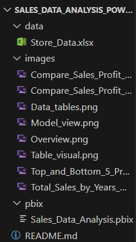

# 📊 Sales Data Analysis – Power BI Dashboard

This Power BI project presents a comprehensive analysis of a retail store's sales performance. It includes interactive dashboards that visualize key business metrics such as Sales, Profit, Quantity Sold, Discounts, and Customer Behavior across various dimensions like Time, Product, Promotion, and Region.

The purpose of this project is to gain actionable insights from sales data, explore patterns over time, compare results across periods, and support data-driven decision-making.

---

## 🛠️ Tools & Technologies Used

- **Power BI Desktop** – Data modeling & interactive visualization
- **Microsoft Excel** – Data source (synthetic sales data)
- **DAX (Data Analysis Expressions)** – Calculated measures & logic
- **Star Schema Data Modeling** – Optimized relational model

---

## 📂 Table of Contents

1. [Project Overview](#-sales-data-analysis--power-bi-dashboard)
2. [Tools & Technologies Used](#️-tools--technologies-used)
3. [Dashboard Screenshots & Explanations](#-dashboard-screenshots--explanations)
4. [Data Model](#-data-model)
5. [Project Folder Structure](#-project-folder-structure)
6. [How to Use](#-how-to-use)
7. [Insights & Observations](#-insights--observations)
8. [Conclusion](#-conclusion)

---

## 📊 Dashboard Screenshots & Explanations

### 1. Overview Dashboard

This dashboard provides a high-level summary of the overall business performance:

- 📉 **Average Discount by Promotion**: Highlights which promotions gave the highest average discounts.
- 🧾 **Number of Orders**: Shows the total number of orders.
- 📈 **Profit vs. Net Sales**: A scatter plot showing a strong linear relationship, confirming that higher profits follow higher sales.
- 🗺️ **Sales by City**: A map visualization that displays total sales by location, helping to identify top-performing cities.

This dashboard is ideal for executives who need a quick snapshot of the business across multiple dimensions.

---

### 2. Top & Bottom Products by Sales, Profit, and Quantity

This dashboard presents a side-by-side comparison of the top 5 and bottom 5 products across three key metrics:

- 💰 **Sales**
- 📦 **Quantity Sold**
- 🧾 **Profit**

**Key Observations:**
- Products like *Apple iPhone 14*, *MacBook Air*, and *Sony Bravia TV* dominate most of the top categories, indicating strong customer demand and profitability.
- On the other hand, items like *Tupperware Lunch Box*, *Nivea Body Lotion*, and *Colgate Toothpaste* consistently appear in bottom segments, suggesting poor performance.

This visual helps identify which products should be promoted more or possibly removed from the catalog.

---

### 3. Sales Trends Over Time (Days, Months, Years)

This dashboard includes three line charts that show how total sales have changed across different time dimensions:

- 📆 **Yearly**: Allows high-level comparisons.
- 📅 **Monthly**: Reveals seasonal patterns and peak months.
- 🗓️ **Daily**: Helps identify specific days with spikes or dips in sales.

**Key Observations:**
- 2023 had the highest total sales across all years.
- October and November are the strongest months, indicating seasonal campaigns or festivals.
- Sales are fairly consistent throughout the year, with minor dips (e.g., in March).

This time-based trend analysis supports forecasting, seasonal planning, and campaign timing decisions.

---

### 4. Compare Sales, Profit & Quantity Between Two Periods

  

This section allows users to **compare key performance metrics** between two custom time periods, selected via independent date filters.

Metrics compared include:

- 💰 **Total Sales**
- 🧾 **Total Profit**
- 📦 **Quantity Sold**

**Visualizations Used:**
- Stacked column chart
- Stacked bar chart

**Key Features:**
- Two slicers allow the selection of different date ranges.
- Charts update dynamically based on user input.
- Enables easy comparison for year-over-year, quarter-over-quarter, or campaign impact analysis.

This dashboard is highly useful for management-level performance reviews and business strategy evaluation.

---

### 5. Interactive Order Table with Filters

This table allows users to explore **detailed transactional-level data** and apply filters across various dimensions.

**Slicers/Filters Available:**
- 📅 **Date**
- 🧍 **Customer Name**
- 📦 **Product Name**
- 🏷️ **Promotion Name**

**Columns Shown:**
- Order ID, Customer ID, Product ID, Promotion ID
- Units Sold, Discount %, Discount Amount
- Net Sales, Total Sales, Profit, Date

This view is especially helpful for data analysts and business users who need to:
- Perform deep-dive analysis
- Validate summary metrics
- Audit specific records

---

### 6. Data Model & Relationships

  

The project follows a **Star Schema** data model to ensure optimized performance, scalability, and clean relationships between tables.

**Key Components:**

- 🧾 **Fact Table**:  
  Contains order-level data including:
  - CustomerID, ProductID, PromotionID, OrderID, Date
  - Sales, Quantity, Profit, Discount, Net Sales, etc.

- 🧩 **Dimension Tables**:
  - `Dim_Customers`
  - `Dim_Product`
  - `Dim_Promotion`
  - `Date Table 1` & `Date Table 2` (for independent period comparison)

- 📐 **Measures Table**:  
  A separate table to store DAX measures (e.g., Total Profit, Net Sales).

**Data Modeling Concepts Applied:**
- Proper **1-to-Many relationships** with directional filtering.
- Usage of **dual date tables** to allow flexible time-based comparisons.
- Avoidance of circular dependencies and inactive relationships.
- Following **best practices in BI modeling** using Power BI.

This foundational model enables the entire reporting structure to work seamlessly and supports complex analysis with performance in mind.

---

### 7. Project Folder Structure

The project is organized in a clean and modular way, as shown below:

This structure ensures clear organization of the project components — from raw data to dashboards and documentation — for easy access and maintenance.

---

### 8. How to Use

To explore this project:

1. **Clone or download the repository** to your local machine.
2. Make sure you have **Power BI Desktop** installed.
3. Open the main Power BI report file: pbix/Sales_Data_Analysis.pbix
4. If prompted, make sure the path to the Excel data file (`Store Data.xlsx`) is correctly connected.
5. Use the interactive filters, date slicers, and visuals to explore sales trends, performance metrics, and product insights.

**Note:** The dataset contains synthetic but realistic data and does not require anonymization.

---

### 9. Insights & Conclusion

✅ This project demonstrates the full Power BI lifecycle:
- Data loading
- Data cleaning & transformation
- Star schema data modeling
- KPI & chart-based visualization
- Time-based comparison
- Dynamic filtering

📌 Key insights extracted:
- October and November are the highest-performing months in sales.
- High-profit and high-sales products are consistent.
- Sales and profit have a strong positive correlation.
- Certain promotions generate higher discounts but not always higher sales.
- The ability to compare different periods adds strategic flexibility.

This project showcases strong capabilities in Power BI modeling, interactive reporting, and business-oriented storytelling.

---

### 10. Contact

If you have any questions, feedback, or collaboration ideas, feel free to reach out:

- 👨‍💻 **Egemen DURGUN**
- 🔗 [LinkedIn](https://www.linkedin.com/in/egemendurgun/)
- 📺 [YouTube](https://www.youtube.com/@egemendurgun)
- 📊 [Kaggle](https://www.kaggle.com/egemendrgn)
- 💻 [GitHub](https://github.com/seawolf1971
